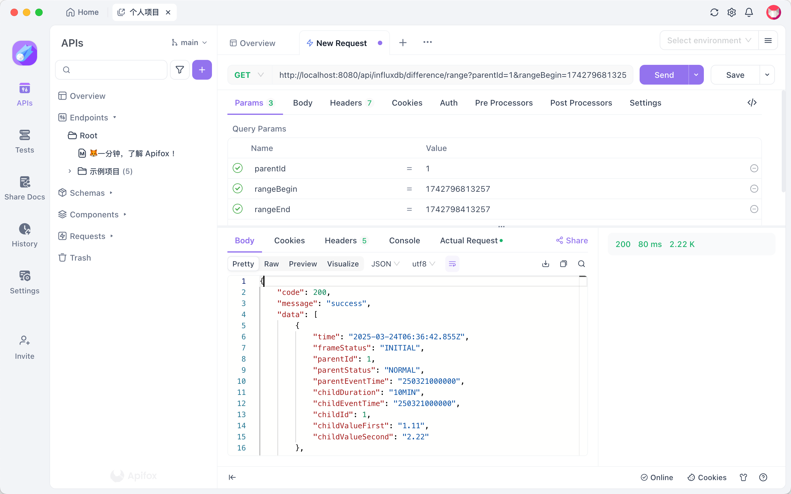
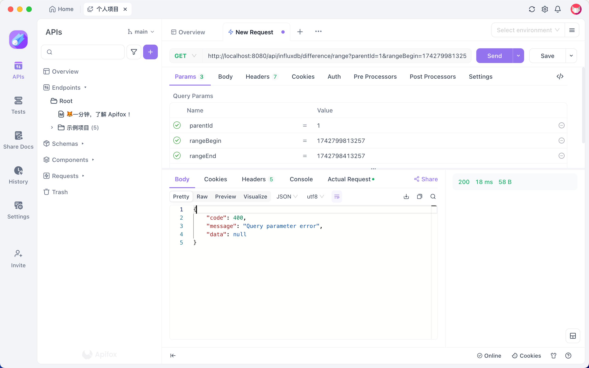
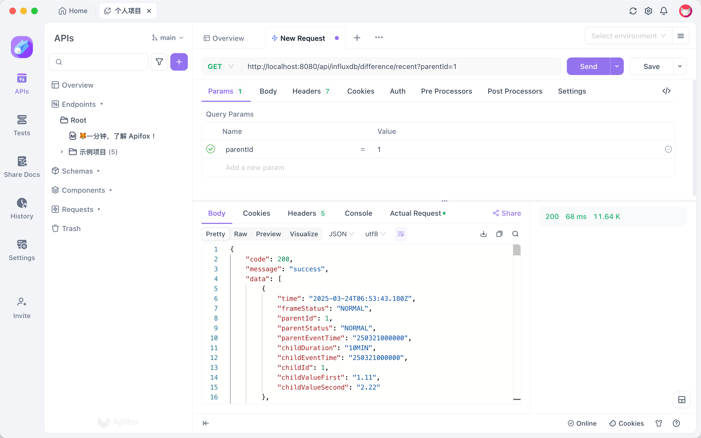
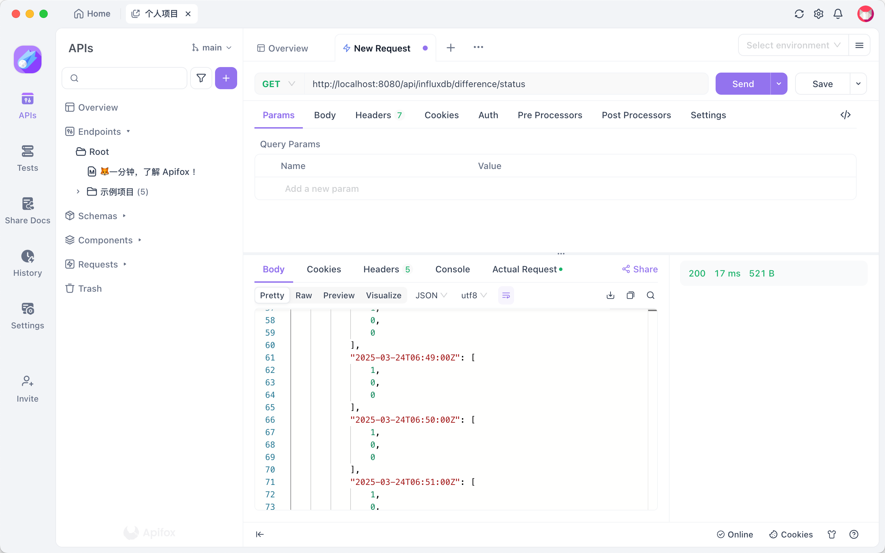
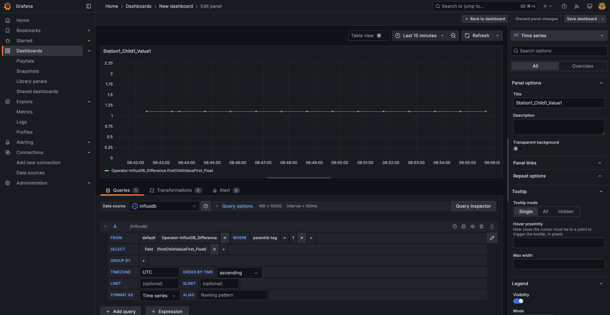

# SpringBoot 后端

## 项目结构

主体
```txt
.
├── Application.java
├── HttpResult.java
├── InfluxDBConfig.java
├── controller
│   ├── difference
│   │   └── DifferenceController.java
│   └── other
│       └── OtherController.java
├── converter
│   ├── difference
│   │   └── DifferenceConverter.java
│   └── other
│       └── OtherConverter.java
├── dao
│   ├── difference
│   │   ├── Difference.java
│   │   └── DifferentStatus.java
│   └── other
│       └── Other.java
├── dto
│   ├── difference
│   │   ├── DifferenceDTO.java
│   │   └── DifferentStatusDTO.java
│   └── other
│       └── OtherDTO.java
└── service
    ├── difference
    │   └── DifferenceService.java
    └── other
        └── OtherService.java
```

* Application，程序启动入口
* HttpResult，controller返回的HTTP响应，正常或者失败
* InfluxDBConfig，数据库配置类，具体配置在application.yml中
* controller，按照数据类型分类，定义具体的业务接口，路由请求调用对应的service
* converter，将数据库dao对象，转换成前端可显示的dto对象，做数据拆分、类型转换的工作
* dao，数据库ORM对象，InfluxDB tag只能为String类型
* dto，返回给前端的对象，对前端友好
* service，具体的业务逻辑实现，根据请求参数查询数据库，返回结果

测试
```txt
.
├── ApplicationTests.java
├── InfluxDB1Test.java
├── InfluxDBGrafanaTest.java
└── InfluxDBInterfaceTest.java
```
* InfluxDB1Test，官方给的例子，介绍了每个API的用法
* InfluxDBGrafanaTest，往数据库中写入假数据，供grafana面板显示
* InfluxDBInterfaceTest，往数据库中写入假数据，测试接口用

目前，只实现了差分站状态及差分改正数最重要的三个后端接口，其他数据请参考Other模板  
TODO：分页分表，OLAP，时序特色查询

## 接口文档

### range
路径：/api/influxdb/difference/range  
描述：查询某个差分站指定时间段内的数据  
输入参数：parentId为Integer类型，rangeBegin和rangeEnd为Long类型，代表UTC标准毫秒时间戳  
返回结果：DifferenceDTO List对象，按照时间倒序，限制最多返回256条  
正常情况：


异常情况：开始时间晚于结束时间


### recent
路径：/api/influxdb/difference/recent  
描述：查询某个差分站最近的64条数据  
输入参数：parentId为Integer类型  
返回结果：DifferenceDTO List对象，按时间倒序，限制最多返回64条  
正常情况：


### status
路径：/api/influxdb/difference/status  
描述：查询系统最近15分钟数据接收情况，每分钟正常、超时、初始状态的差分站数量  
输入参数：无  
返回结果：Map对象，key为分钟，value为三个数，分别对应正常、超时、初始数量  
正常情况：


## 结合Grafana

实时观测差分站改正数，面板中绘制最近15分钟的数据走势



## 安装部署
### influxdb

```shell
docker run -d -p 8086:8086 --name influxdb influxdb:1.7.7
```

### influxdb java client
项目地址 https://github.com/influxdata/influxdb-java
有三个版本，我使用的是v1版本，pom依赖如下

```xml
<dependency>
  <groupId>org.influxdb</groupId>
  <artifactId>influxdb-java</artifactId>
  <version>2.24</version>
</dependency>
```

## Warning
InfluxDB查询有两种方式，FLUX和influxQL，举例如下

```text
data = from(bucket: "example-bucket")
    |> range(start: -1h)
    |> filter(fn: (r) => r._measurement == "example-measurement" and r._field == "example-field")
```

```sql
SELECT used_percent FROM "example-db"."example-rp"."example-measurement" WHERE host=host1
```


直接拼接SQL语句，需要注意SQL注入风险  
如果上面接口中的parent为String类型，不能直接拼接，如下
```java
final String queryString = String.format(
        "SELECT * FROM \"%s\" WHERE \"parentId\" = '%s' ORDER BY \"time\" DESC LIMIT 64",
        measureName, parentId
);
```

```java
Strig parentId = "'3' or '1' = '1'";
```

此时执行的SQL语句为
`SELECT * FROM "Operator-InfluxDB_Difference" WHERE "parentId" = '3' or '1' = '1' ORDER BY "time" DESC LIMIT 64`，发生了注入，能获取所有数据


解决方案，强制parentId为整数类型

```java
try {
   // prevent SQL injection
   final int id = Integer.parseInt(parentId);
} catch (NumberFormatException e) {
   log.info("parentId format error.");
   return null;
}
```
