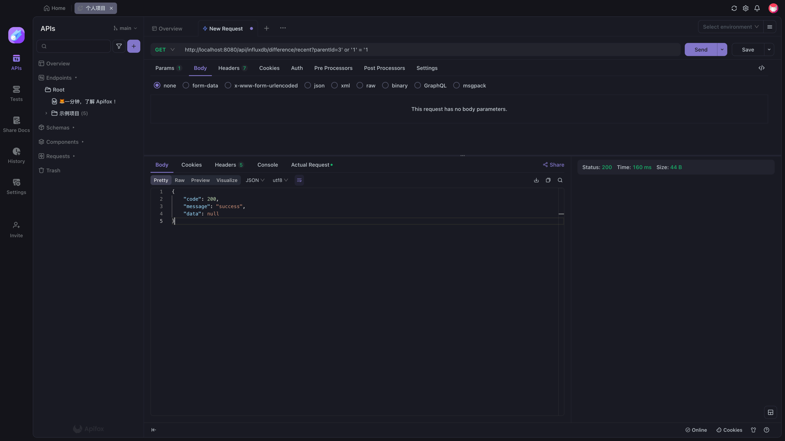

# SpringBoot 后端

## 项目结构


只实现了差分站状态及差分改正数这一类数据的两个后端接口，其他数据类似

### controller

定义了两个最有价值的GET接口，根据请求参数查询数据库返回Http响应
1. 指定差分站编号，开始结束时间，查询该范围内的数据，最多256条，结果按照时间倒序  
   差分站编号为String类型，无前导零  
   开始结束时间为Long类型，代表毫秒级的时间戳
2. 指定差分站编号，查询该站最近的64条数据  
   差分站编号为String类型，无前导零
3. TODO，分页分表，OLAP，时序特色查询

### converter

数据库对象，一整个对象太大了，不方便前端显示，需要做拆分，而且有些字段不用展示。因此，需要转化为前端友好的DTO对象

### dao、dto

分别是数据库对象和前端显示对象

### service

请求路由到controller，controller会传入参数，调用这部分的服务实现  
InfluxDB查询有两种方式，FLUX和influxQL，举例如下  

```text
data = from(bucket: "example-bucket")
    |> range(start: -1h)
    |> filter(fn: (r) => r._measurement == "example-measurement" and r._field == "example-field")
```

```sql
SELECT used_percent FROM "example-db"."example-rp"."example-measurement" WHERE host=host1
```

后者我比较熟悉，但是直接执行SQL语句需要注意注入风险，而且parentId是字符串，不能直接拼接，如下  
```java
final String queryString = String.format(
                "SELECT * FROM \"%s\" WHERE \"parentId\" = '%s' ORDER BY \"time\" DESC LIMIT 64",
                measureName, parentId
        );
```


此时执行的SQL语句为`SELECT * FROM "Operator-InfluxDB" WHERE "parentId" = '3' or '1' = '1' ORDER BY "time" DESC LIMIT 64`，发生了注入  

解决方案，强制parentId为整数类型

```java
try {
   // prevent SQL injection
   final int id = Integer.parseInt(parentId);
} catch (NumberFormatException e) {
   log.info("parentId format error.");
   return null;
}
```



### 杂项

* HttpResult，Http响应类，controller返回结果
* InfluxDBConfig，Bean，管理数据库配置连接
* InfluxDB1Test，官方给的例子，介绍了每个API的用法
* InfluxDBPrepareTest，在数据库中插入模拟数据，接口测试用


## 测试结果

两个接口正常工作


## 安装部署
### influxdb

```shell
docker run -d -p 8086:8086 --name influxdb influxdb:1.7.7
```

### influxdb java client
项目地址 https://github.com/influxdata/influxdb-java
有三个版本，我使用的是v1版本，pom依赖如下

```xml
<dependency>
  <groupId>org.influxdb</groupId>
  <artifactId>influxdb-java</artifactId>
  <version>2.24</version>
</dependency>
```